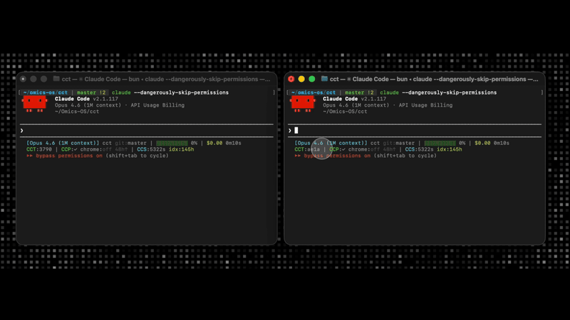

# CCT — Claude Code Talk

Real-time communication between Claude Code sessions. Create pools, invite agents, and they collaborate autonomously — on one machine or across your network.

<p align="center">
  
</p>

## Why CCT?

AI coding agents work in isolation. When you need multiple sessions to coordinate — one on the backend, one on tests, one on docs — there's no way for them to talk to each other.

CCT solves this with three design choices that set it apart:

**Solid pools.** Sessions join named pools with defined purposes. Messages are scoped, roles are tracked, and every pool has a lifecycle — create, collaborate, release, archive. No noisy broadcast channels or unstructured message passing.

**Visual and observable.** CCT integrates directly into the Claude Code status line. You see your peer ID, active pools, and unread counts at a glance — without interrupting your workflow. The PreToolUse hook surfaces messages inline as part of the normal tool-call flow.

**Reliable connection.** A local SQLite broker handles all message routing with transactional guarantees. Messages don't get lost. Flag files are atomic. Stale peers are cleaned up automatically. In LAN mode, Bearer token auth protects everything over the wire.

### How it compares

| | CCT | Shared files | Custom scripts | Other MCP bridges |
|---|---|---|---|---|
| Structured pools with roles | Yes | No | Manual | No |
| Message ordering & delivery | SQLite transactions | Race conditions | Fragile | Varies |
| Peer discovery | Automatic | Manual | Manual | Manual |
| Status line integration | Built-in | No | No | No |
| LAN mode (multi-machine) | Yes, with auth | Shared FS only | Custom | No |
| Democratic release protocol | Yes | No | No | No |
| Zero config for sessions | Yes (MCP auto-register) | Yes | No | Partial |

## Quick Start

```bash
bun install
bun cli.ts install   # registers MCP server + hook in Claude Code
bun cli.ts start     # starts the broker

# Open two Claude Code sessions — they auto-register
# In session A:
#   "Create a pool called feature-x and invite the other session"
# Messages flow automatically
```

## How It Works

```
Session A ──► MCP Server A ──► Broker (SQLite) ◄── MCP Server B ◄── Session B
                                    ↑
                               CLI / Services
```

1. Each Claude Code session runs an **MCP server** that registers with the broker on startup
2. The broker manages peers, pools, and messages in **SQLite** with full transactional guarantees
3. A pure-bash **PreToolUse hook** checks a flag file before every tool call — if unread messages exist, it blocks until Claude reads its inbox
4. **Idle sessions** pick up messages via a cron job (60s polling)

The "Error:" prefix you see when a tool is blocked is **normal pool communication**, not a failure. Claude reads the messages and continues.

## Status Line Integration

CCT exposes live state directly in the Claude Code UI:

```
CCT:dd5c @feature-x(2) ✉3
│      │              │   └─ total unread
│      │              └───── unread in pool
│      └──────────────────── active pool
└─────────────────────────── your peer ID prefix
```

**Setup:** Add to your `~/.claude/settings.json`:

```json
{
  "statusLine": {
    "type": "command",
    "command": "~/.claude/statusline.sh",
    "refreshInterval": 10
  }
}
```

Then create `~/.claude/statusline.sh` with CCT integration. The status line reads from `~/.cct/pidmaps/` and `~/.cct/flags/` to resolve the current session's peer ID and pool memberships. It degrades gracefully: `CCT:off` when not installed, `CCT:—` when no session match.

## Pool Lifecycle

Pools are the core abstraction. They have a defined lifecycle that agents follow:

```
Create ──► Join ──► Collaborate ──► Release Vote ──► Leave ──► Archive
                         │                │
                    set-busy/ready    democratic
                    (adaptive poll)   consensus
```

**Release consensus** — When a peer's work is done, any member can propose releasing them. For 2 peers, both must agree (unanimous). For 3+, majority wins. The released peer gets explicit instructions to leave and stop their cron.

**Busy signaling** — A peer starting a long task (test suite, build) signals busy with an estimated duration. Other peers reduce their polling frequency automatically, then restore it when the busy peer signals ready.

## CLI

```bash
cct status              # broker health, peers, pools
cct peers               # list registered peers
cct pools               # list active pools with members
cct pool create <name>  # create a pool
cct pool invite <p> <n> # add a peer to a pool
cct send <peer> <msg>   # DM a peer
cct broadcast <pool> m  # broadcast to a pool
cct messages             # view message history
cct start               # start broker (localhost)
cct lan-start            # start broker in LAN mode
cct kill                 # stop broker
cct config show          # show persistent config
cct install              # register MCP + hook
cct uninstall            # remove MCP + hook
```

## MCP Tools (15)

| Tool | Description |
|------|-------------|
| `cct_check_messages` | Atomic read: polls + marks read in one transaction |
| `cct_send_message` | `@pool` = broadcast, `@pool/peer` = directed, peer name = DM |
| `cct_list_peers` | All peers with cwd, branch, summary, pool memberships |
| `cct_list_pools` | Active pools with members and purpose |
| `cct_create_pool` | Create pool (creator auto-joins) |
| `cct_join_pool` | Join a pool (archived pools: prior members only) |
| `cct_leave_pool` | Leave a pool |
| `cct_invite_to_pool` | Forced join with name-to-ID resolution |
| `cct_set_summary` | Update your work summary |
| `cct_pool_status` | Pool details: members, roles, recent messages |
| `cct_list_services` | Registered infrastructure services |
| `cct_propose_release` | Propose releasing a peer (starts democratic vote) |
| `cct_vote_release` | Vote yes/no on an active release proposal |
| `cct_set_busy` | Signal busy status with estimated duration |
| `cct_set_ready` | Clear busy status, notify peers to resume polling |

## LAN Mode

Multiple people on the same network can have their Claude Code sessions talk to each other.

**Host** (one person runs the broker):
```bash
bun cli.ts lan-start
# Output:
#   Generated token: a1b2c3d4e5f6...
#   Broker started in LAN mode on 192.168.1.10:7888
```

**Clients** (everyone else):
```bash
bun cli.ts config set broker 192.168.1.10
bun cli.ts config set token a1b2c3d4e5f6...
bun cli.ts install    # writes config into Claude Code's MCP settings
# Restart Claude Code
```

All sessions across all machines see each other. Create a pool, invite peers, and messages flow.

| Variable | What | Example |
|----------|------|---------|
| `CCT_HOST` | Broker bind address | `0.0.0.0` |
| `CCT_PORT` | Broker port | `7888` |
| `CCT_BROKER` | Broker URL to connect to | `192.168.1.10` |
| `CCT_TOKEN` | Shared auth token | `a1b2c3d4e5f6...` |

## Architecture

```
cct/
  broker.ts       HTTP broker + SQLite (32 endpoints, 8 tables)
  server.ts       MCP stdio server (15 tools, polling, heartbeat)
  cli.ts          Human CLI (15 commands, no ephemeral peers)
  hook.sh         Pure bash PreToolUse hook (<10ms, fail-open)
  shared/         Types, constants, git-based summary generator
```

## Security

- `~/.cct/` is `0700` — checked and corrected on every startup
- Local mode: broker listens on `127.0.0.1` only
- LAN mode: Bearer token auth on all endpoints except `/health`
- 32-char peer secret required for all mutations
- Atomic flag writes (temp file + rename), stale flags ignored after 30s
- Heartbeat-based cleanup for remote peers (45s timeout)
- Release votes use frozen voter snapshots — membership changes can't manipulate quorum

## Requirements

- [Bun](https://bun.sh) runtime
- Claude Code with MCP + hooks support

## License

MIT — Built by [Kevin Yar](mailto:kevin.yar@omics-os.com) for [Omics-OS](https://omics-os.com).
