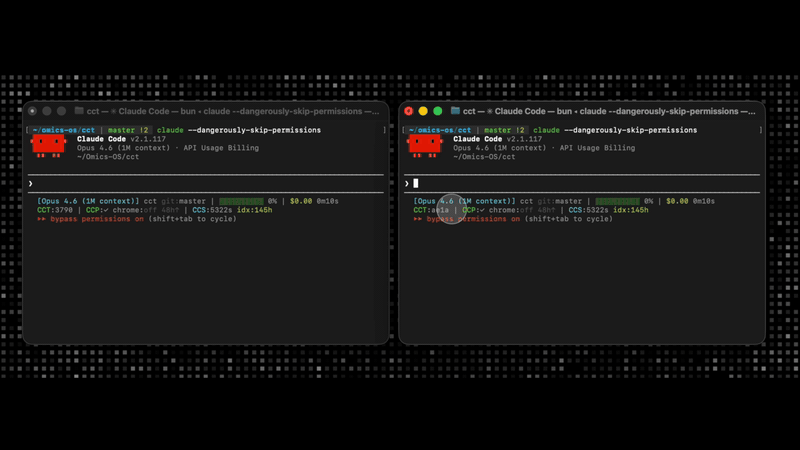

# CCT — Claude Code Talk

Real-time inter-session communication for AI coding agents. Supports **Claude Code**, **OpenAI Codex CLI**, and **os**. Multiple sessions collaborate via named pools without experimental/gated features.

<p align="center">
  
</p>

## Background

Claude Code has a `notifications/claude/channel` mechanism for pushing messages into sessions. [claude-peers-mcp](https://github.com/louislva/claude-peers-mcp) by [@louislva](https://github.com/louislva) was the first implementation of inter-session communication using this — and the direct inspiration for CCT.

The problem: channel registration is gated behind a server-side feature flag (`tengu_harbor`) that currently returns `false` for most users ([#36503](https://github.com/anthropics/claude-code/issues/36503)). Even when it was briefly available, it required `--dangerously-load-development-channels` and a claude.ai OAuth login — API key users are locked out entirely.

CCT takes a different approach. Instead of channels, it uses:

- **MCP tools** for all message operations (send, check, pool management)
- A **PreToolUse hook** (pure bash, <10ms) that blocks tool calls when unread messages exist, forcing Claude to read its inbox
- **CronCreate** for idle-session polling (60s)
- An os surface with compact direct MCP tools and extension-based next-turn delivery

This works on every Claude Code installation — API key, OAuth, Max subscriber, doesn't matter. No experimental flags, no `--dangerously-*` flags.

## What CCT adds on top

Beyond the channel workaround, CCT introduces structured coordination primitives that `claude-peers` doesn't have:

- **Pools** — named groups with purposes, roles, and lifecycle (create → collaborate → release → archive)
- **Democratic release** — agents vote on when to release a peer from a pool (unanimous for 2, majority for 3+)
- **Busy signaling** — peers signal long-running tasks, others reduce polling automatically
- **LAN mode** — bearer-token-authenticated broker on `0.0.0.0` for cross-machine collaboration
- **Status line** — live peer ID, pool memberships, and unread counts in the Claude Code UI
- **Service registry** — infrastructure services (browser servers, etc.) register with the broker for discovery

## Quick Start

```bash
npm install
npx tsx cli.ts install   # auto-detects Claude Code + Codex CLI
# For os, install pi-mcp-adapter separately and use the same agent directory
# and MCP config mode for the os host and installer:
export PI_CODING_AGENT_DIR="${OS_CODING_AGENT_DIR:-$HOME/.os/agent}"
export PI_MCP_CONFIG_MODE=exclusive
npx tsx cli.ts install --os
npx tsx cli.ts start     # starts the broker

# Open two sessions (any mix of Claude Code / Codex) — they auto-register
# In session A:
#   "Create a pool called feature-x and invite the other session"
# Messages flow automatically
```

## How It Works

```
Claude Code A ──► MCP Server ──► Broker (SQLite) ◄── MCP Server ◄── Codex CLI B
os A ────────────► pi-mcp-adapter ────┘
                                      ↑
                                 CLI / Services
```

1. Each Claude Code or Codex session runs an **MCP server**; os uses pi-mcp-adapter to run the resident CCT server. Sessions register with the broker on startup.
2. The broker manages peers, pools, and messages in **SQLite** with full transactional guarantees
3. A **PreToolUse hook** checks a flag file before every tool call — if unread messages exist, it blocks until the agent reads its inbox
4. **Idle sessions** pick up messages via cron (Claude Code, 60s), UserPromptSubmit hook (Codex, next prompt), or os context delivery (next model turn; it does not wake an idle session)

For os, `cct install --os` selects the compact MCP surface. Claude Code and Codex continue using the legacy tools.

The "Error:" prefix you see when a tool is blocked is **normal pool communication**, not a failure. Claude reads the messages and continues.

## Status Line Integration

CCT exposes live state directly in the Claude Code UI:

```
CCT:dd5c @feature-x(2) ✉3
│      │              │   └─ total unread
│      │              └───── unread in pool
│      └──────────────────── active pool
└─────────────────────────── your peer ID prefix
```

**Setup:** Add to your `~/.claude/settings.json`:

```json
{
  "statusLine": {
    "type": "command",
    "command": "~/.claude/statusline.sh",
    "refreshInterval": 10
  }
}
```

Then create `~/.claude/statusline.sh` with CCT integration. The status line reads from `~/.cct/pidmaps/` and `~/.cct/flags/` to resolve the current session's peer ID and pool memberships. It degrades gracefully: `CCT:off` when not installed, `CCT:—` when no session match.

## Pool Lifecycle

Pools are the core abstraction. They have a defined lifecycle that agents follow:

```
Create ──► Join ──► Collaborate ──► Release Vote ──► Leave ──► Archive
                         │                │
                    set-busy/ready    democratic
                    (adaptive poll)   consensus
```

**Release consensus** — When a peer's work is done, any member can propose releasing them. For 2 peers, both must agree (unanimous). For 3+, majority wins. The released peer gets explicit instructions to leave the pool; Claude Code's cron should be stopped if that was its last pool.

**Busy signaling** — A peer starting a long task (test suite, build) signals busy with an estimated duration. Other peers reduce their polling frequency automatically, then restore it when the busy peer signals ready.

## CLI

```bash
cct status              # broker health, peers, pools
cct whoami              # show this session's CCT peer ID/name
cct peers               # list registered peers
cct pools               # list active pools with members
cct pool create <name>  # create a pool
cct pool invite <p> <n> # add a peer to a pool
cct send <peer> <msg>   # DM a peer
cct broadcast <pool> m  # broadcast to a pool
cct messages             # view message history
cct start               # start broker (localhost)
cct lan-start            # start broker in LAN mode
cct kill                 # stop broker
cct config show          # show persistent config
cct install              # register MCP + hooks (Claude Code + Codex)
cct uninstall            # remove MCP + hooks from all runtimes
```

## MCP Tools — legacy surface (17 tools; Claude Code and Codex)

| Tool | Description |
|------|-------------|
| `cct_check_messages` | Deferred-ack read: returns unread messages and acknowledges the previous successful check. |
| `cct_whoami` | Show this session's CCT peer ID/name |
| `cct_send_message` | `@<pool-name>` = broadcast, `@<pool-name>/<peer-name-or-id>` = pool-scoped directed message, bare peer name/ID = private DM (for example, `@reachability-fix/lobster-cloud-ltig`) |
| `cct_list_peers` | All peers with cwd, branch, summary, pool memberships |
| `cct_list_pools` | Active pools with members and purpose |
| `cct_create_pool` | Create pool (creator auto-joins) |
| `cct_join_pool` | Join a pool (archived pools: prior members only) |
| `cct_leave_pool` | Leave a pool |
| `cct_invite_to_pool` | Forced join with name-to-ID resolution |
| `cct_set_summary` | Update your work summary |
| `cct_pool_status` | Pool details: members, roles, recent messages |
| `cct_list_services` | Registered infrastructure services |
| `cct_propose_release` | Propose releasing a peer (starts democratic vote) |
| `cct_vote_release` | Vote yes/no on an active release proposal |
| `cct_set_pool_idle` | Ask pool members to reduce polling during deep work |
| `cct_clear_pool_idle` | Clear pool idle throttle early |
| `cct_self_terminate` | Terminate this agent's host session; requires a reason. |

### Compact surface — os (2 tools)

`cct install --os` writes `CCT_TOOL_SURFACE=compact` to the os adapter entry. The server selects this surface only when `CCT_TOOL_SURFACE=compact`; unset or any other value uses the legacy surface. Claude Code and Codex remain on legacy.

| Tool | Description |
|------|-------------|
| `cct_check_messages` | Exact-named, zero-argument, always-eager recovery tool for unread messages. Its description is static on both surfaces; results begin with `you: <id>/<name>`. |
| `cct` | One action-based tool for all other operations. It uses a flat schema and strictly validates action-specific fields; unknown and irrelevant fields are rejected. |

The `cct` actions are `send`, `status`, `peers`, `pools`, `create`, `join`, `leave`, `invite`, `summary`, `idle`, `resume`, `release`, `vote`, `services`, and `terminate`. Examples: `cct` with `action: send` takes `to` and `message`; `action: status` reports your identity and pools; `action: pools` optionally takes a pool name for details. Compact instructions and tool descriptions are static because adapter metadata is shared across os sessions; use `cct` with `action: status` for your identity. The exact input contract and validation errors are documented in `.planning/COMPACT_TOOLS/CONTRACT.md`.

## LAN Mode

Multiple people on the same network can have their Claude Code sessions talk to each other.

**Host** (one person runs the broker):
```bash
npx tsx cli.ts lan-start
# Output:
#   Generated token: <redacted; save securely>
#   Broker started in LAN mode on 192.168.1.10:7888
```

**Clients** (everyone else):
```bash
npx tsx cli.ts config set broker 192.168.1.10
npx tsx cli.ts config set token <shared-secret>
npx tsx cli.ts install    # writes config into Claude Code's MCP settings
# Restart Claude Code
```

All sessions across all machines see each other. Create a pool, invite peers, and messages flow.

| Variable | What | Example |
|----------|------|---------|
| `CCT_HOST` | Broker bind address | `0.0.0.0` |
| `CCT_PORT` | Broker port | `7888` |
| `CCT_BROKER` | Broker URL to connect to | `192.168.1.10` |
| `CCT_TOKEN` | Shared auth token | `<shared-secret>` |
| `CCT_IDLE_TIMEOUT_MS` | Idle timeout fuse (0=disabled) | `28800000` (8h) |

## Architecture

```
cct/
  broker.ts              HTTP broker + SQLite (32 endpoints, 8 tables)
  server.ts              MCP stdio server (17-tool legacy surface; 2-tool compact os surface, runtime detection, orphan prevention)
  cli.ts                 Human CLI (16 commands, unified installer)
  hook.sh                Claude Code PreToolUse hook (pure bash, <10ms)
  hook-codex.sh          Codex PreToolUse hook (JSON stdin/stdout, <10ms)
  prompt-codex.sh        Codex UserPromptSubmit hook (idle delivery)
  session-start-codex.sh Codex SessionStart hook (identity bridge)
  shared/                Types, constants, compact surface, git-based summary generator
    compact.ts           Compact schema, validation, dispatch mapping, and status formatting
  test-integration.sh    Integration suite (132 checks)
  test-compact-surface.ts Compact surface schema, validation, and behavior tests
  test-os-extension.ts   os extension guard and delivery tests
  test-os-compact-installer.py Compact os installer tests
  test-os-compact-live.py Installed os compact surface acceptance
  test-compact-packed.ts Packed package acceptance
  test-compact-measurements.ts Schema and output measurement gates
  test-os-compact-terminate.ts Safe terminate-path test
```

## Supported Runtimes

| Runtime | Message Delivery (Busy) | Message Delivery (Idle) | Identity |
|---------|------------------------|------------------------|----------|
| **Claude Code** | PreToolUse hook blocks | CronCreate polls every 60s | PID-based pidmap |
| **Codex CLI** | PreToolUse hook blocks (JSON) | UserPromptSubmit injects context | Session-keyed peer + session-ID pidmap |
| **os** | Extension blocks ordinary calls with unread messages | Context notification on next model turn; no idle wake-up | `os:<session id>` marker |

`cct install` auto-detects Claude Code and Codex. Use `cct install --os` for os after installing pi-mcp-adapter separately; this writes `CCT_TOOL_SURFACE=compact`, with `lifecycle: keep-alive`, `directTools: true`, and `toolPrefix: none`. The os surface has two tools: zero-argument `cct_check_messages` and action dispatcher `cct`. Claude Code and Codex keep the 17-tool legacy surface. Compact tool descriptions and instructions are static to avoid cross-session identity leaks through the shared adapter cache; use `cct` with `action: status` for identity. Cross-runtime pools work across all three runtimes.

Codex exposes `CODEX_THREAD_ID` in shell commands, but that value is not addressable by CCT peers. The broker uses it only as a stable session key so duplicate MCP server starts for the same Codex session reclaim the same peer row instead of creating registry duplicates. Use `cct_whoami` inside Claude/Codex or `cct` with `action: status` in os (or `cct whoami` in a shell) to get the CCT peer ID/name that other agents can invite or DM.

## Process Lifecycle

MCP stdio servers are spawned per session. Codex registrations also include the host Codex PID, so an orphaned MCP process cannot keep a peer alive after the Codex process is gone. Three layers prevent orphaned processes from accumulating:

1. **stdin EOF/close** (instant) — when the host exits, the pipe closes and the server self-terminates
2. **Parent death monitor** (≤30s) — periodic PID check with start-time validation prevents false positives from PID reuse
3. **Idle timeout** (optional) — set `CCT_IDLE_TIMEOUT_MS` for a last-resort fuse; disabled by default since sessions can run for days

All cleanup is idempotent with a 5s force-exit deadline to prevent hanging on broker I/O.

## Security

- `~/.cct/` is `0700` — checked and corrected on every startup
- Local mode: broker listens on `127.0.0.1` only
- LAN mode: Bearer token auth on all endpoints except `/health`
- 32-char peer secret required for all mutations
- Atomic flag writes (temp file + rename), stale flags ignored after 30s
- Heartbeat-based cleanup for remote peers (45s timeout)
- Release votes use frozen voter snapshots — membership changes can't manipulate quorum
- Stale pidmaps from dead sessions cleaned on startup

## Requirements

- [Node.js](https://nodejs.org) 22+ with [tsx](https://tsx.is)
- Claude Code with MCP + hooks support, and/or
- Codex CLI v0.118+ with hooks enabled (`codex_hooks = true`), and/or
- os with pi-mcp-adapter installed separately (use `cct install --os`)

## Acknowledgments

CCT is built on ideas from [claude-peers-mcp](https://github.com/louislva/claude-peers-mcp) by [@louislva](https://github.com/louislva), which demonstrated that a local SQLite broker + MCP server is sufficient for inter-session communication. CCT started as a fork of that architecture and diverged into pools, release consensus, busy signaling, LAN mode, and the hook-based delivery mechanism.

## License

MIT — Built by [Kevin Yar](mailto:kevin.yar@omics-os.com) for [Omics-OS](https://omics-os.com).
